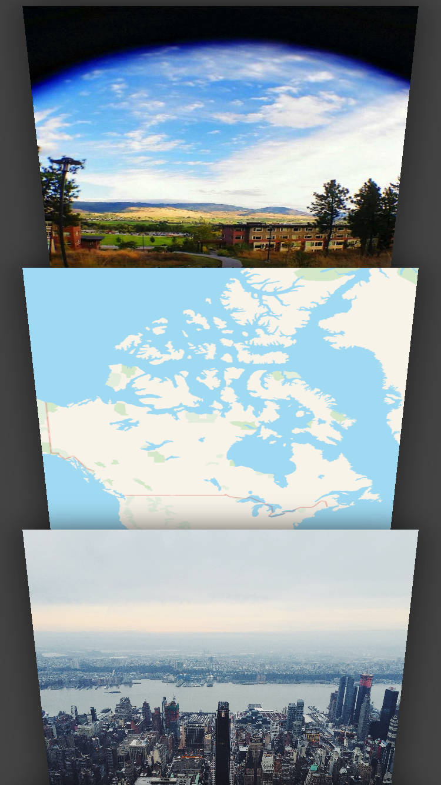
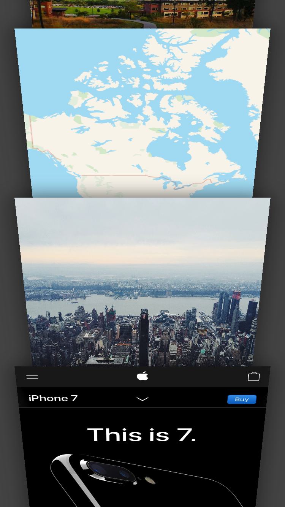
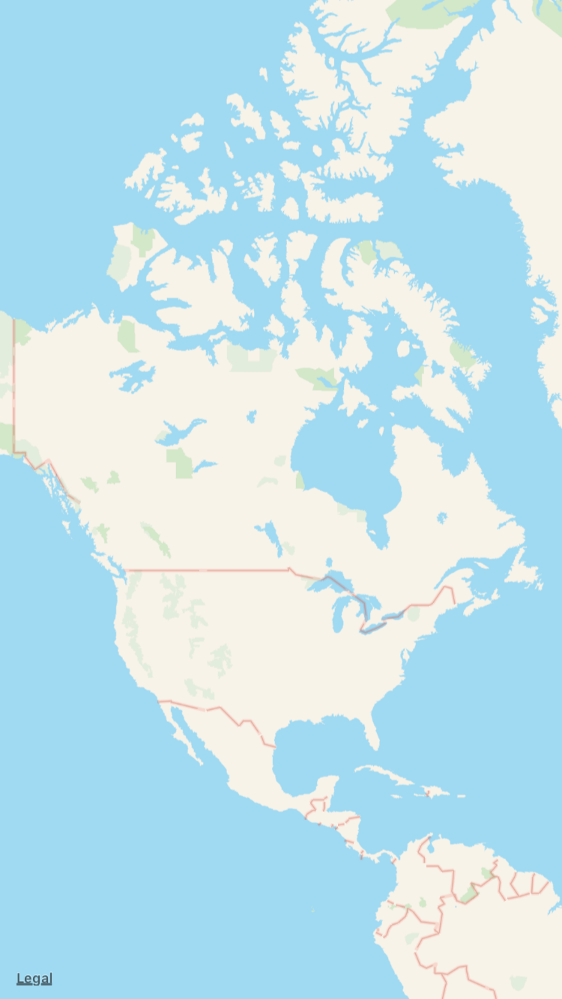

# UI_3D_Transformation

UI_3D_Transformation demonstrates applying 3D effects to an arbitrary UIView

A few different views are chosen randomly to facilitate this example: images,
a map view, and a web view. A view hierarchy is shown that is akin to the tab
switching user experience in Safari on iOS and the 3D nature of this effect is
implemented using CALayer's CATransform3D.

UIScrollView, Core Animation, MKMapView, Gesture Recognizers, 3D Animation

### Screenshots
---------------

  
